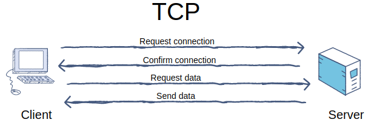
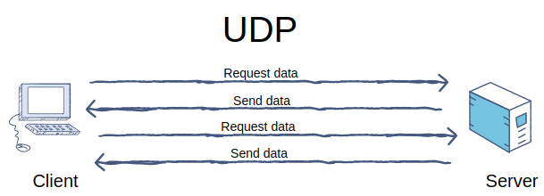

# Curso: Proyecto Integrador de Redes de comunicacion y Sistemas operativos.  
## Descripción del proyecto.
En este proyecto se pretende simular una red mediante nodos, cada nodo representa un componente especifico.
Estos estan separados por colores; el azul equivale al cliente, el verde al enrutador, el naranja al dns y el rosado al controlador.

## Componentes del programa.  

### Modulo Verde
Este es el modulo principal que coordina todas conecciones, similar a un router en una red.
Cabe destacar que todo el modulo verde esta implementado en `C++`, esto con el fin de lograr un mayor redimiento en la ejecucion del programa.
 Dicho modulo verde se separa por capas, segun sea su funcionalidad, estas capaz son las siguientes:

* Capa de transporte
* Capa de enlace
* Capa de red
* Agente rosado
* Agente naraja
 
#### Capa de transporte 
 Es la encargada de manejar todas las conexiones con el modulo azul y viceversa. 
 Estos modulos se comunican por medio de el protocolo `TCP`. 
 Dado que el protcolo de `TCP` ocupa una confirmacion de recepcion del mensaje, existen dos canales de comunicacion entre ambos modulos.  

 #### Capa de enlace 
 En esta capa es donde se establece la comunicacion con otros nodos verdes.
 Dado que los nodos verdes son los encargados de manejar las comunicaciones, tanto internas como externas, 
 es necesario que haya una capa encargada exclusivamente de la comunicacion entre verdes. 
 Esta capa se comica con otra por medio de el protocolo `UDP`.  

  #### Capa de red 
 Esta capa se encarga de gestionar cada tipo de paquete segun sea su protocolo. 
 Posteriormente lo entrega en la cola adecuada para su debido procesamiento. Conecta todos los paquetes de mensajes que 
 pasan por el modulo verde.

  #### Agente naranja
 Este agente  ejecuta el modulo del naranja para conocer la informacion necesaria para la inicializacion del nodo. 
 De esta manera es que el modulo verde conoce sus propios atributos. 
 Maneja todas las conexiones con el modulo naranja. Estas conexiones se establecen mediante `pipes`.

  #### Agente rosado
 Es la encargada de manejar todas las conexiones con el modulo rosado encargado de manejar todas las operaciones de enrutamiento. 
 Estos modulos se comunican por medio de `pipes`. 

### Modulo Naranja
Este modulo es el encargado de brindarle los atributos tales como el nombre, ip, puerto y demas, al nodo.  

### Modulo Azul
Este modulo es el encargado de conectar el programa con el usuario,  
 recibir por entrada estandar  

### Modulo Rosado
Este modulo es el encargado de realizar todas las 
operaciones de enrutamiento del nodo.  

## Secuencia del programa.  
Como anteriormente se dijo existen varios componentes importantes, pero vamos a explicarlos segun sea el orden de compilacion.

* Primero se ejecuta el comando make en la carpeta src/green, esto se encargara de crear el ejecutable con nombre de server.

* Luego con el ejecutable se ejecuta de manera ./server #id_nodo, esto llamara al programa en su modo simple, que no utiliza la logica arbol generador.

* ./server #id_nodo -t(ejecuta modo simple explicitamente)

* ./server #id_nodo -i(ejecuta modo inteligente(Heartbeat y 3WayHandShake))

## Nomenclatura de Cases en Logs

* Case 0: Algo ocurrio de manera exitosa.

* Case 1: Un envio ocurrio de forma exitosa.

* Case 2: Una recepcion ocurrio de forma exitosa.

* Case 3: Ocurrio un error.
